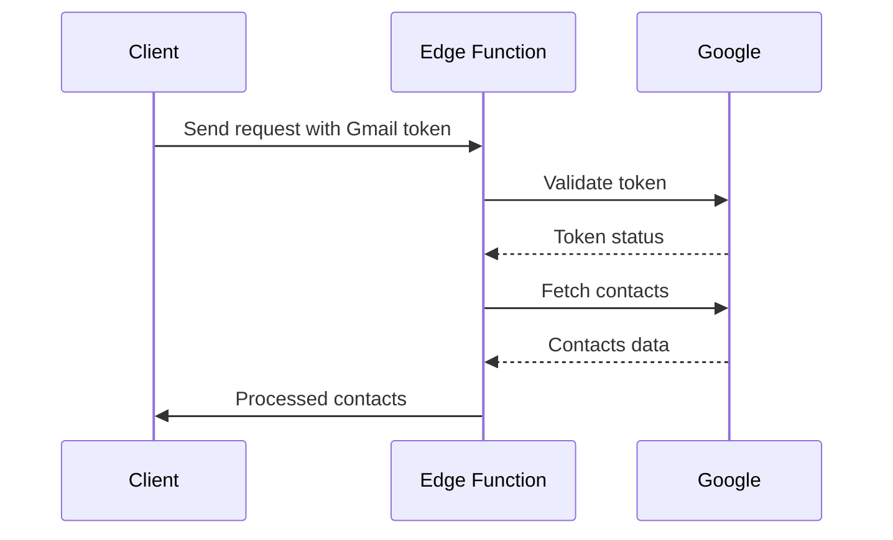
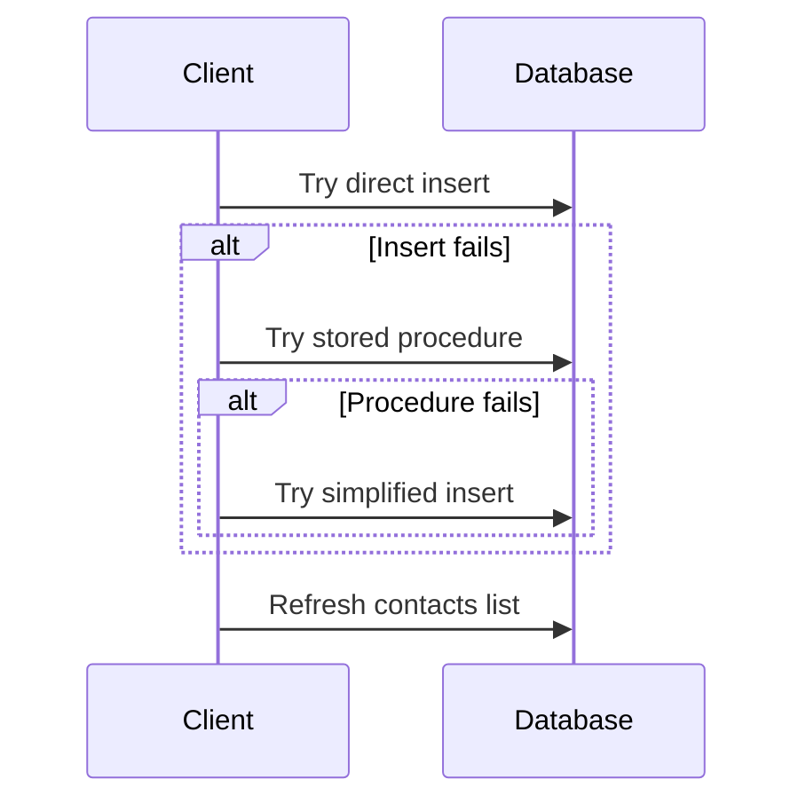

# Gmail Contact Import Feature

## Overview
The Gmail Contact Import feature allows users to seamlessly import their contacts from Gmail into the CRM system. This implementation provides a robust solution with proper error handling, logging, and user feedback mechanisms.

## System Architecture

### Components Overview
```
├── Edge Function (gmail-contacts)
│   └── Handles Gmail API interaction and contact processing
├── Client Hook (useGmailContactsImport)
│   └── Manages import flow and state
└── Database
    ├── Tables
    │   ├── contacts (stores contact data)
    │   ├── companies (stores company data)
    │   └── user_integrations (stores OAuth tokens)
    └── Functions
        └── create_contact (stored procedure)
```

## Key Components

### 1. Edge Function (`supabase/functions/gmail-contacts/index.ts`)
- Handles Gmail API communication
- Features:
  ```typescript
  - Token validation against Google's tokeninfo endpoint
  - Fetches both main and "other" contacts
  - Processes contact data into standardized format
  - Handles CORS and authentication
  - Includes detailed logging for debugging
  ```
- Security:
  - Validates API keys
  - Checks OAuth scopes
  - Uses secure headers

### 2. Client Hook (`src/hooks/useGmailContactsImport.ts`)
- Manages the import process
- Features:
  ```typescript
  - Token refresh mechanism
  - Progress tracking
  - Error handling with fallbacks
  - Company creation/linking
  - Contact deduplication
  ```
- State Management:
  ```typescript
  interface ImportProgress {
    total: number;
    processed: number;
    successful: number;
    failed: number;
  }
  ```

### 3. Database Structure
```sql
-- contacts table
CREATE TABLE contacts (
  id UUID PRIMARY KEY,
  user_id UUID REFERENCES auth.users,
  first_name TEXT,
  last_name TEXT,
  email TEXT,
  phone TEXT,
  title TEXT,
  company_id UUID REFERENCES companies,
  website TEXT,
  tags TEXT[] DEFAULT '{}',
  source TEXT,
  created_at TIMESTAMPTZ
);

-- companies table
CREATE TABLE companies (
  id UUID PRIMARY KEY,
  user_id UUID REFERENCES auth.users,
  name TEXT,
  website TEXT
);

-- user_integrations table
CREATE TABLE user_integrations (
  id UUID PRIMARY KEY,
  user_id UUID REFERENCES auth.users,
  provider TEXT,
  access_token TEXT,
  refresh_token TEXT,
  expires_at TIMESTAMPTZ
);
```

## Import Flow

### 1. Authentication Flow


### 2. Contact Processing Flow


## Error Handling Strategy

### Multiple Fallback Levels
```typescript
// Level 1: Direct Insert
const { error } = await supabase.from('contacts').insert(contactData);

// Level 2: Stored Procedure
if (error) {
  const { error: sqlError } = await supabase.rpc('create_contact', ...);
}

// Level 3: Simplified Insert
if (sqlError) {
  const { error: simpleError } = await supabase
    .from('contacts')
    .insert(simplifiedContact);
}
```

## Deployment Requirements

### 1. Environment Variables
```bash
VITE_SUPABASE_URL=your_supabase_url
VITE_SUPABASE_ANON_KEY=your_anon_key
GOOGLE_CLIENT_ID=your_google_client_id
GOOGLE_CLIENT_SECRET=your_google_client_secret
```

### 2. Required Google OAuth Scopes
```
https://www.googleapis.com/auth/contacts.readonly
https://www.googleapis.com/auth/contacts.other.readonly
```

## Maintenance and Debugging

### 1. Logging Points
- Edge Function logs contact processing
- Client logs import progress
- Database logs through RPC calls

### 2. Common Issues and Solutions
```
- 401 Unauthorized: Check token refresh
- 400 Bad Request: Check data format
- Array errors: Check tags format
```

## Future Improvements

### 1. Potential Enhancements
- Batch processing for large contact lists
- Real-time progress updates
- Contact merge detection
- Custom field mapping
- Contact group support

### 2. Scalability Considerations
- Rate limiting for API calls
- Pagination for large contact lists
- Background processing for imports
- Caching for frequently accessed data

## Support and Troubleshooting

If you encounter issues with the Gmail contact import feature:

1. Check the browser console for detailed error messages
2. Verify OAuth token validity and scopes
3. Ensure all required environment variables are set
4. Check Supabase Edge Function logs for API-related issues
5. Verify database connection and permissions

For more detailed troubleshooting steps, refer to the [TROUBLESHOOTING.md](../../TROUBLESHOOTING.md) guide. 